# Southern Haulers TMS - Architecture Diagrams

> **Last Updated**: 2025-10-24
> **Version**: 1.0
> **Purpose**: Visual architecture specifications for the Southern Haulers TMS platform

---

## Table of Contents

1. [System Architecture Overview](#1-system-architecture-overview)
2. [Monorepo Structure](#2-monorepo-structure)
3. [Event-Driven Integration Flow](#3-event-driven-integration-flow)
4. [PortPro Integration Architecture](#4-portpro-integration-architecture)
5. [Quote-to-Shipment Workflow](#5-quote-to-shipment-workflow)
6. [Agent Orchestration](#6-agent-orchestration)
7. [Compliance Workflows](#7-compliance-workflows)
8. [Domain Model](#8-domain-model)
9. [User Journeys](#9-user-journeys)
10. [Data Flow & Authority Model](#10-data-flow--authority-model)
11. [Observability & Monitoring](#11-observability--monitoring)
12. [Security & Access Control](#12-security--access-control)

---

## 1. System Architecture Overview

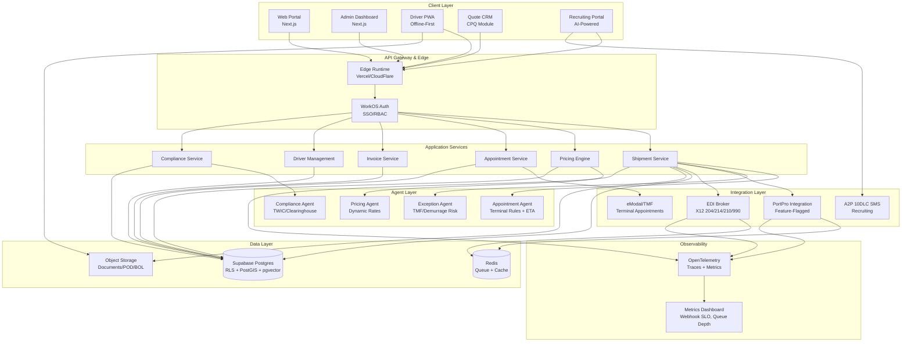

---

## 2. Monorepo Structure

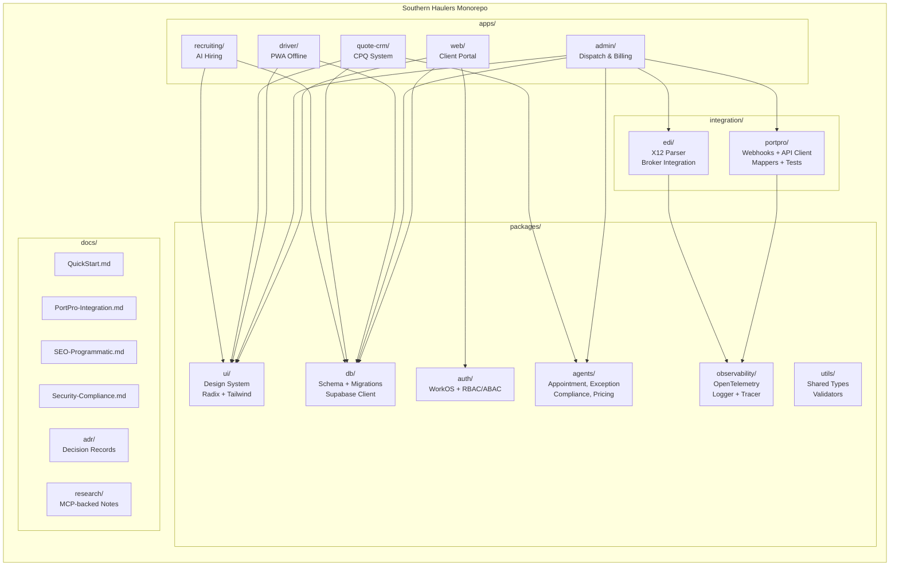

---

## 3. Event-Driven Integration Flow

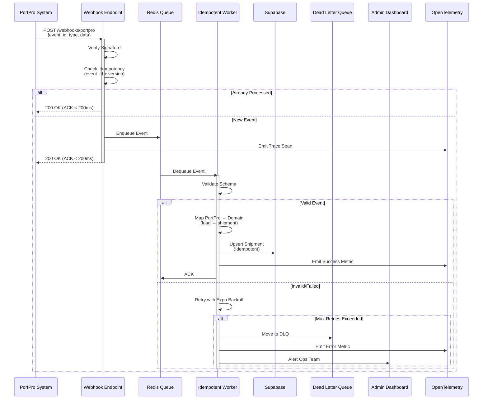

---

## 4. PortPro Integration Architecture

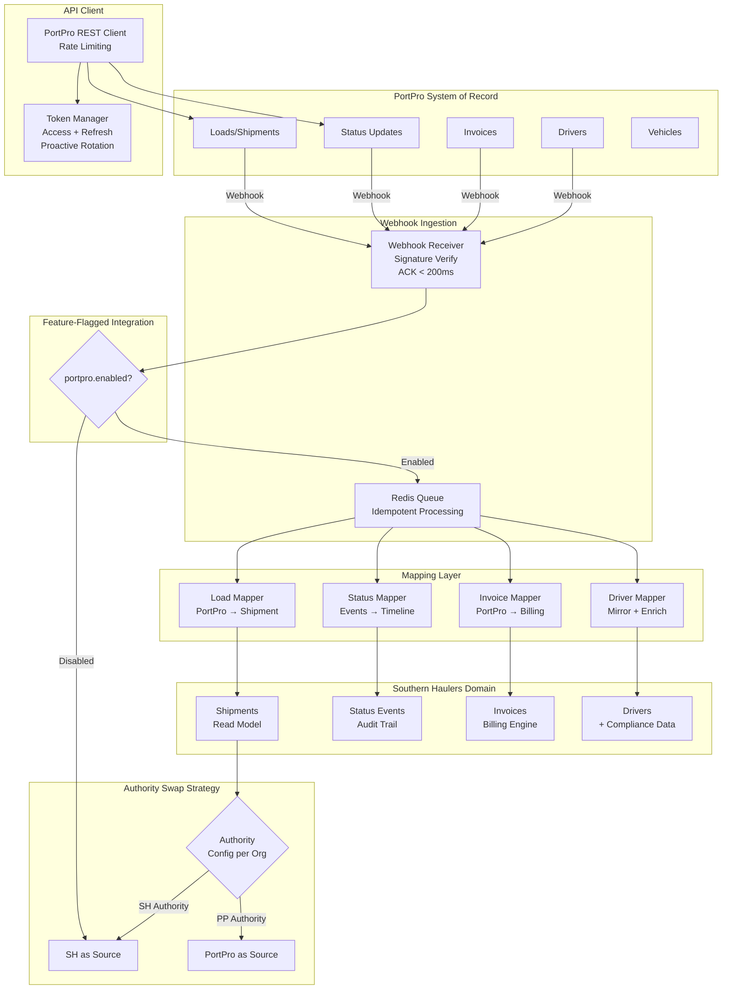

---

## 5. Quote-to-Shipment Workflow

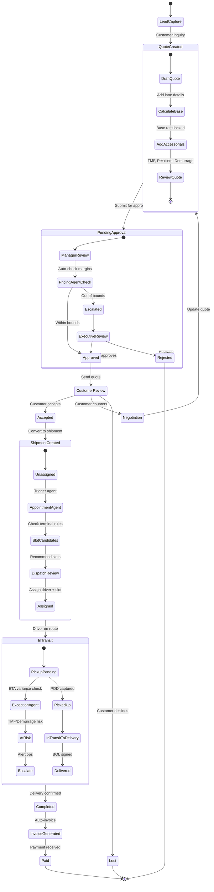

---

## 6. Agent Orchestration

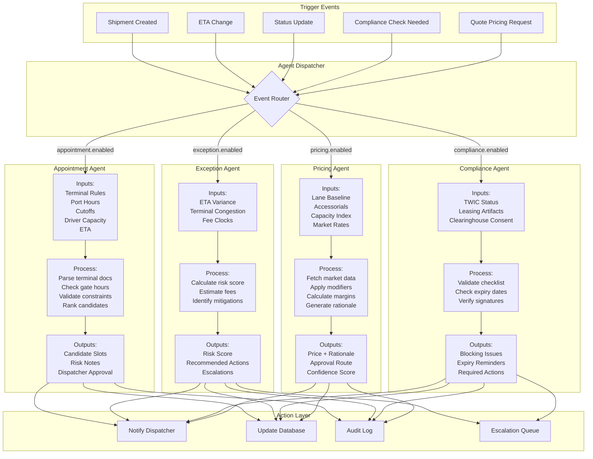

---

## 7. Compliance Workflows

### 7.1 Driver Lease-On Process (49 CFR Part 376)

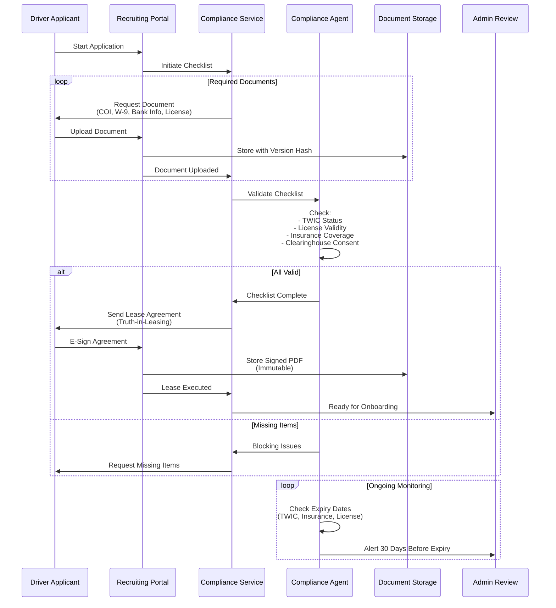

### 7.2 FMCSA Clearinghouse Consent

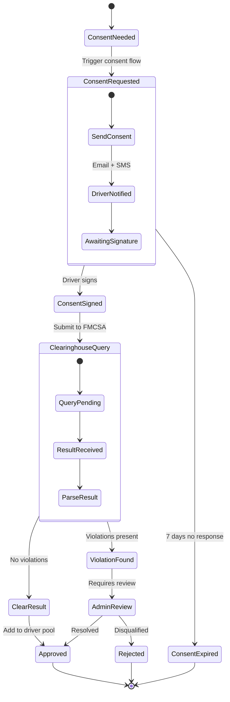

---

## 8. Domain Model

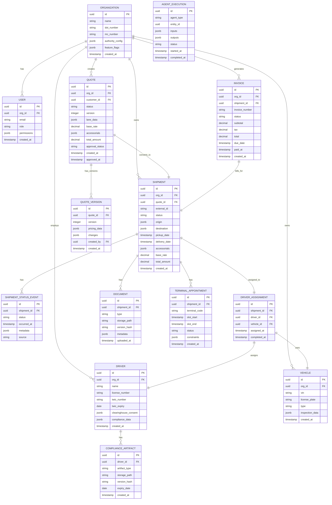

---

## 9. User Journeys

### 9.1 Customer Quote Request → Booking

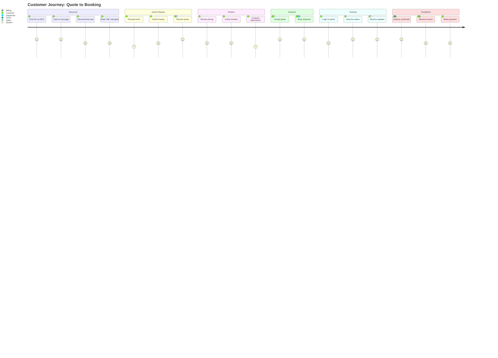

### 9.2 Dispatcher Workflow

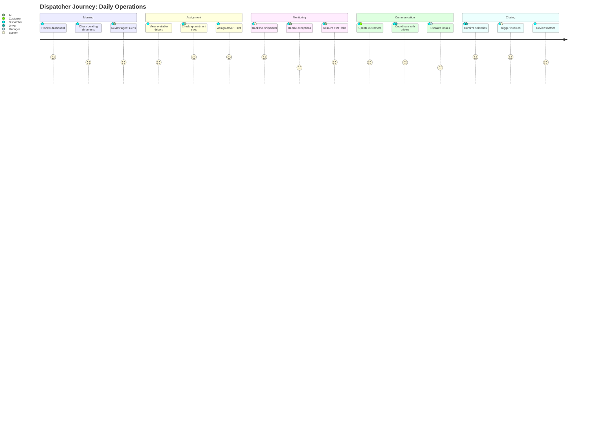

### 9.3 Driver Experience

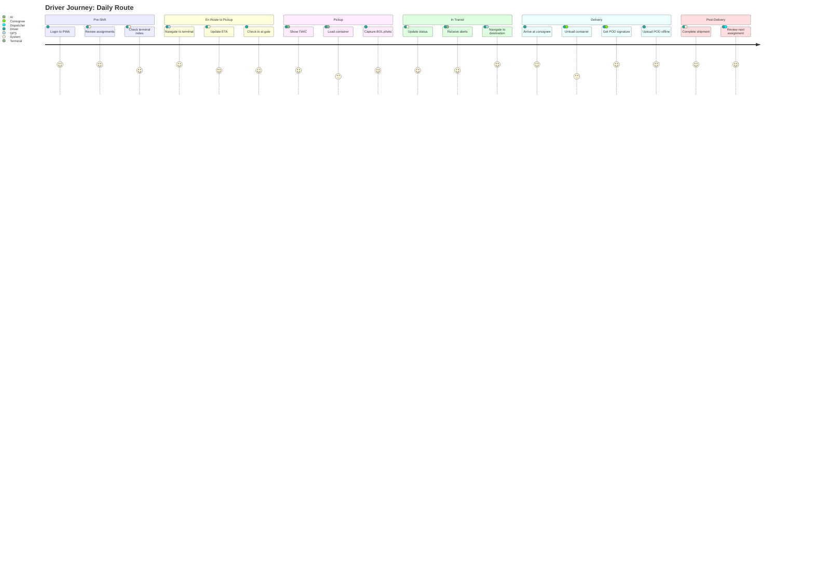

---

## 10. Data Flow & Authority Model

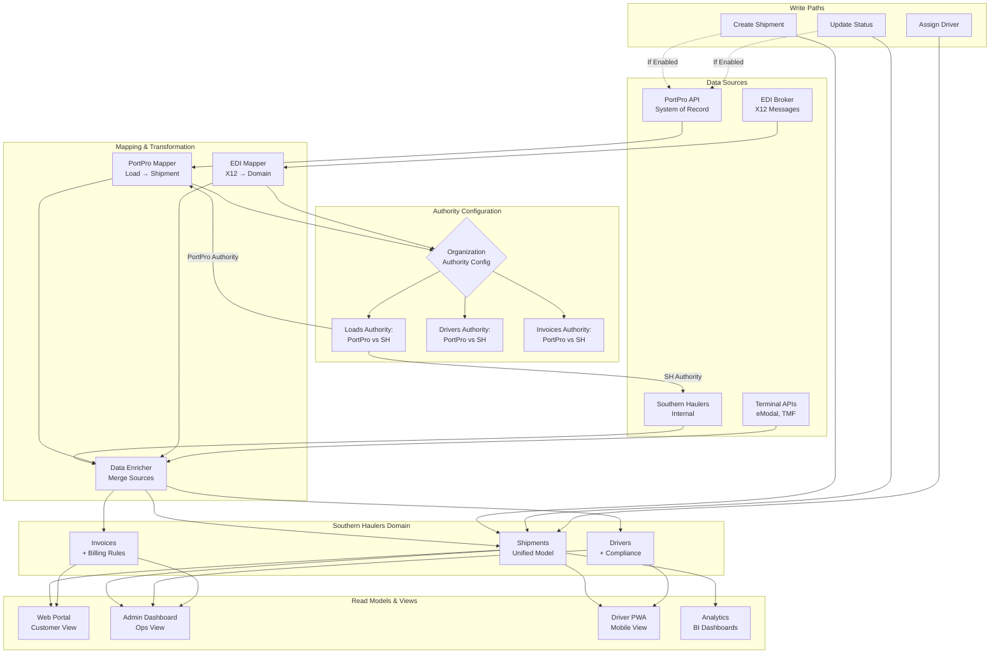

---

## 11. Observability & Monitoring

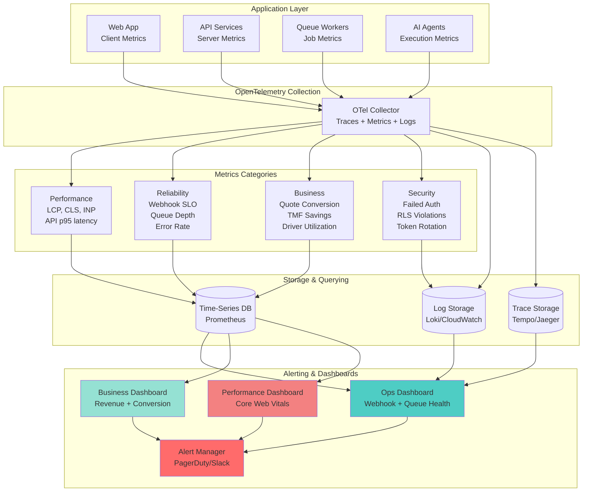

---

## 12. Security & Access Control

### 12.1 Authentication & Authorization Flow

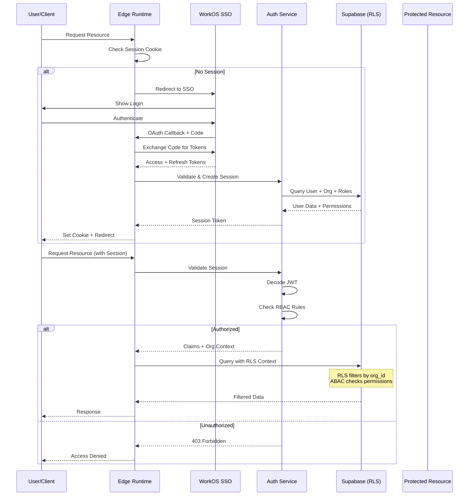

### 12.2 Row-Level Security (RLS) Model

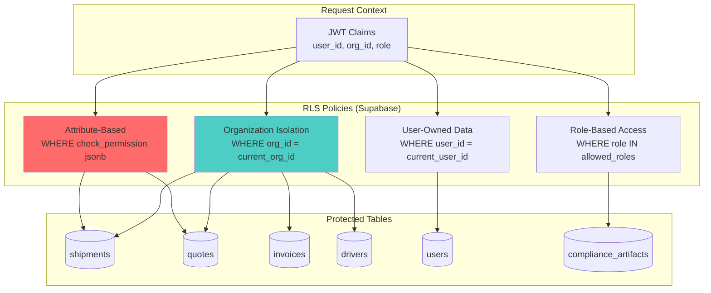

### 12.3 Feature Flag & Authority Configuration

```mermaid
graph LR
    subgraph "Organization Config"
        ORG[Organization Record]
        FLAGS[feature_flags JSONB]
        AUTHORITY[authority_config JSONB]
    end

    subgraph "Feature Flags"
        FF_PORTPRO[portpro.enabled]
        FF_EDI[edi.enabled]
        FF_AGENTS[agents.*.enabled]
    end

    subgraph "Authority Config"
        AUTH_LOADS[loads: 'portpro' | 'sh']
        AUTH_DRIVERS[drivers: 'portpro' | 'sh']
        AUTH_INVOICES[invoices: 'portpro' | 'sh']
    end

    subgraph "Runtime Behavior"
        CHECK{Check Flag}
        ROUTE{Route by Authority}
        PP_INTEGRATION[PortPro Integration]
        SH_INTERNAL[SH Internal]
    end

    ORG --> FLAGS
    ORG --> AUTHORITY

    FLAGS --> FF_PORTPRO
    FLAGS --> FF_EDI
    FLAGS --> FF_AGENTS

    AUTHORITY --> AUTH_LOADS
    AUTHORITY --> AUTH_DRIVERS
    AUTHORITY --> AUTH_INVOICES

    FF_PORTPRO --> CHECK
    AUTH_LOADS --> ROUTE

    CHECK -->|Enabled| ROUTE
    CHECK -->|Disabled| SH_INTERNAL

    ROUTE -->|'portpro'| PP_INTEGRATION
    ROUTE -->|'sh'| SH_INTERNAL
```

---

## Diagram Summary

These diagrams cover:

1. **System Architecture Overview** - Complete tech stack and component interactions
2. **Monorepo Structure** - Apps, packages, integrations, docs organization
3. **Event-Driven Integration Flow** - Webhook → Queue → Worker pattern with idempotency
4. **PortPro Integration Architecture** - Feature-flagged sync with authority swap strategy
5. **Quote-to-Shipment Workflow** - Complete state machine from lead to payment
6. **Agent Orchestration** - AI agents for appointments, exceptions, compliance, pricing
7. **Compliance Workflows** - Driver lease-on and FMCSA Clearinghouse consent flows
8. **Domain Model** - Complete ERD with relationships and key fields
9. **User Journeys** - Customer, dispatcher, and driver experience maps
10. **Data Flow & Authority Model** - Multi-source data integration with configurable authority
11. **Observability & Monitoring** - OpenTelemetry-based metrics, traces, logs, and dashboards
12. **Security & Access Control** - WorkOS SSO, RLS policies, RBAC/ABAC, feature flags

---

**Next Steps:**
- Use these diagrams as architectural blueprints during implementation
- Update diagrams as new features/integrations are added
- Reference in ADRs (Architecture Decision Records)
- Share with stakeholders for alignment
